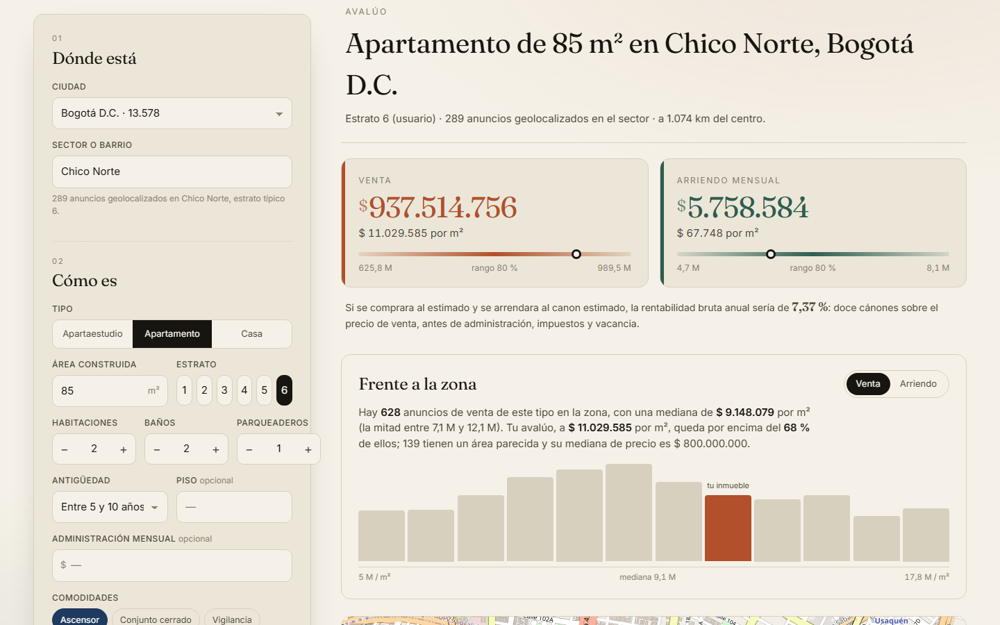
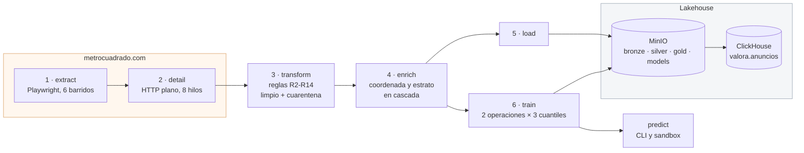
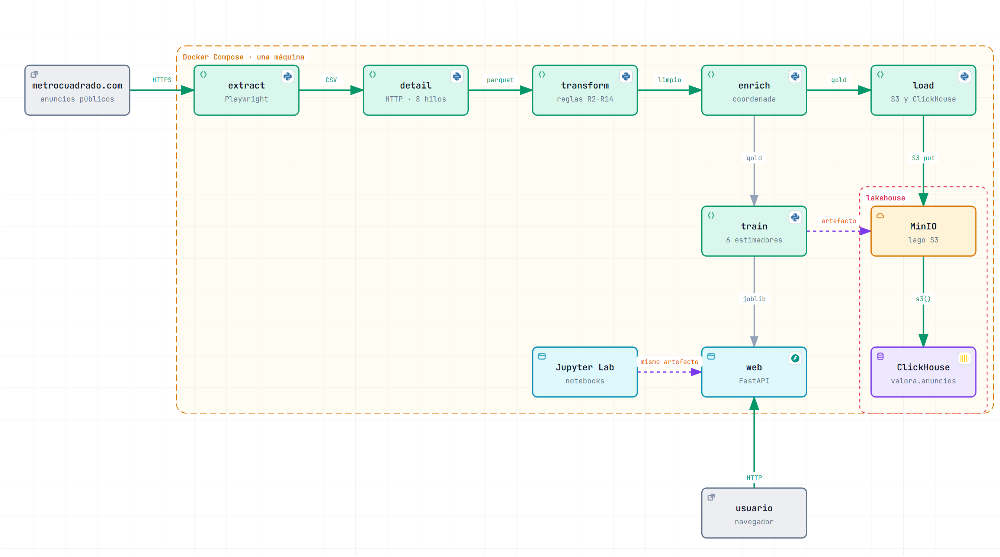
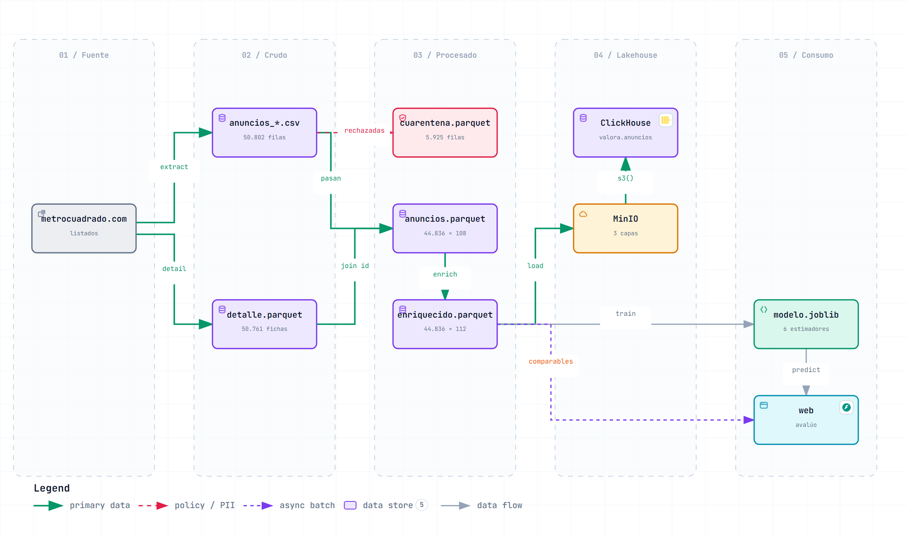
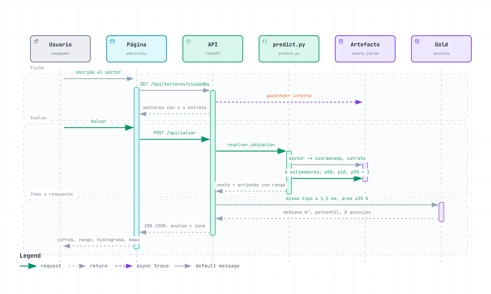
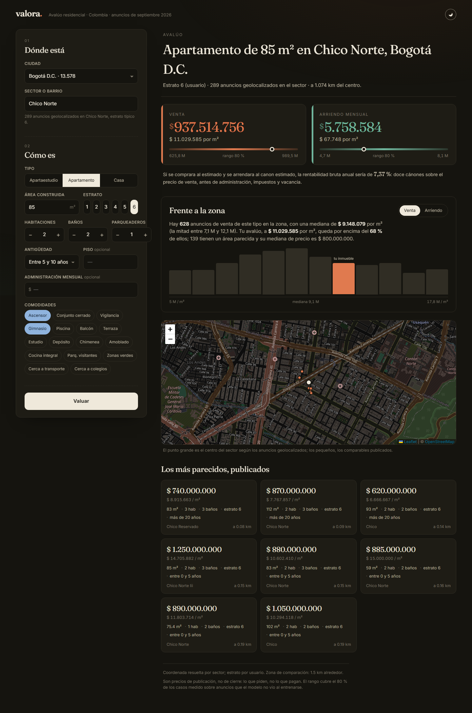

<div align="center">

# valora-etl-pipeline

**De 50.000 anuncios inmobiliarios a un modelo que valúa un inmueble en venta y en arriendo.**<br>
Un pipeline ETL de seis etapas, un lakehouse con MinIO + ClickHouse, un modelo con rango de
confianza y una interfaz web que lo pone al lado de los anuncios de la zona. Todo con un
`docker compose`.



[](https://github.com/juanmayorquin/valora-etl-pipeline/actions/workflows/ci.yml)


</div>

---

## Qué hace

Extrae los anuncios residenciales de [metrocuadrado.com](https://www.metrocuadrado.com), visita
el detalle de cada uno, los sanea contra un conjunto de reglas de calidad, resuelve la
ubicación de cada inmueble, los deja en un lakehouse y entrena dos modelos de precio: uno para
**venta** y otro para **arriendo**. Al final hay una **interfaz web** y un sandbox en notebook
donde describís un inmueble y el modelo te dice cuánto vale, con rango, y cómo se compara con
lo que se publica alrededor.

Cada etapa se valida a sí misma y sale con código 1 si algo no cierra. Cada decisión de
modelado se midió antes de tomarse, y lo que no aportó **se borró**, con el número que lo
condenó anotado en el código.

## Arquitectura



**MinIO es el lago y la fuente de verdad; ClickHouse es el warehouse.** La data queda en dos
lugares a propósito: si mañana cambia el esquema, el lago tiene los Parquet originales y
ClickHouse se reconstruye desde ahí. Al revés no se puede.

### Diagramas de ingeniería

Tres diagramas hechos con [archify](https://github.com/tt-a1i/archify), validados en su perfil
*showcase* (sin cruces ni etiquetas superpuestas) y con evidencia de navegador sin desborde a
1440, 1600 y 1920 px. Cada uno tiene una versión **interactiva** en HTML (temas, zoom, búsqueda,
vistas guiadas, exportación): abrí el archivo desde un clon, GitHub no la renderiza.

| | |
|---|---|
| **Arquitectura de contenedores** · [`docs/diagramas/arquitectura.html`](docs/diagramas/arquitectura.html) | **Flujo de los datos** · [`docs/diagramas/flujo-de-datos.html`](docs/diagramas/flujo-de-datos.html) |
|  |  |

**Una solicitud de avalúo, paso a paso** · [`docs/diagramas/valuacion.html`](docs/diagramas/valuacion.html)



## Arranque en tres comandos

Sólo hace falta Docker (Engine 20.10+ con `compose` v2). Ni Python, ni Chromium.

```bash
git clone https://github.com/juanmayorquin/valora-etl-pipeline.git && cd valora-etl-pipeline
docker compose up -d                      # MinIO + ClickHouse
docker compose run --rm reprocesar        # transform -> enrich -> load -> train
```

Eso parte de lo que ya está versionado en `data/raw/` (los anuncios extraídos y su detalle),
construye el stage limpio, lo enriquece, lo carga al lakehouse y entrena el modelo.
**Unos siete minutos** en una máquina normal (el entrenamiento se lleva seis), y como el
modelo entrenado viene en el repo, el sandbox y `predict.py` funcionan **antes** de correr nada, y sin tocar la red: todo lo que
necesita ya viene en el repo.

Después, la interfaz web:

```bash
docker compose up -d web                  # http://localhost:8000
```

Describís el inmueble (ciudad, sector con autocompletar, tipo, área, estrato, antigüedad,
comodidades…) y la página devuelve el precio de venta y el canon de arriendo con su rango del
80 %, y los pone al lado de la zona: cuántos anuncios parecidos hay alrededor, la mediana por
metro cuadrado, en qué percentil cae tu avalúo, un histograma, el mapa con los comparables y
los ocho más parecidos con enlace al anuncio original. Modo claro y oscuro.



El sandbox en notebook hace lo mismo desde Python:

```bash
docker compose --profile notebooks up -d  # Jupyter en http://localhost:8888 (token: valora)
```

y abrí `notebooks/05_modelo_y_sandbox.ipynb`. O por línea de comandos:

```bash
docker compose run --rm train python src/predict.py --ciudad "Bogotá D.C." --sector "Chicó Norte" \
  --tipo apartamento --area 85 --habitaciones 2 --banos 2 --parqueaderos 1 --estrato 6 \
  --antiguedad "Entre 5 y 10 años" --comodidades ascensor,gimnasio
```

```
Bogotá D.C. - Chicó Norte (sector conocido, 289 comparables)
  coordenada: sector | estrato 6 (usuario) | 1.074 km del centro
  venta     $ 937.514.756   rango $ 625.846.504 - $ 989.536.353 | $ 11.029.585/m²
  arriendo  $ 5.758.584   rango $ 4.697.474 - $ 8.055.940 | $ 67.748/m²
  rentabilidad bruta anual implícita: 7.37 %
```

> **El camino completo, con scraping**, es `docker compose run --rm pipeline`: agrega el
> extract (3–4 h de Chromium contra el sitio) y el detail (~1 h) antes del transform. La
> imagen del scraper pesa ~1,5 GB más por Chromium; sólo ese servicio la construye.

Las credenciales y puertos salen de `.env` (copiá `.env.example`). Sin `.env`, valen los
defaults de desarrollo: usuario `valora`, contraseña `valora123`.

## Los servicios

| Servicio | Comando | Qué hace | Cuánto tarda |
|---|---|---|---|
| `reprocesar` | `docker compose run --rm reprocesar` | Etapas 3 → 6 desde el raw versionado | minutos |
| `pipeline` | `docker compose run --rm pipeline` | Las seis etapas, scraping incluido | 4–5 h |
| `scraper` | `docker compose run --rm scraper` | 1 · extract: barre el sitio a `data/raw/` | 3–4 h |
| `detail` | `docker compose run --rm detail` | 2 · detail: la ficha de cada anuncio | ~1 h la 1.ª vez, reanudable |
| `transform` | `docker compose run --rm transform` | 3 · transform: `data/raw/` → `data/processed/` | segundos |
| `enrich` | `docker compose run --rm enrich` | 4 · enrich: coordenada, estrato y distancia al centro, sin red | segundos |
| `load` | `docker compose run --rm load` | 5 · load: sube a MinIO y puebla ClickHouse | segundos |
| `train` | `docker compose run --rm train` | 6 · train: entrena, evalúa y publica el artefacto | ~6 min |
| `web` | `docker compose up -d web` | La interfaz web sobre el modelo versionado, en `:8000` | — |
| `jupyter` | `docker compose --profile notebooks up -d` | Jupyter Lab con los notebooks, en `:8888` | — |
| `pipeline-periodico` | `docker compose --profile periodico up -d` | El pipeline completo cada `INTERVALO_HORAS` | permanente |

Todas las etapas comparten la imagen `valora-etl:pipeline` y montan `./data` y `./models`
como volúmenes: los archivos quedan en tu disco. La imagen lleva una copia de `src/`, así
que **si tocás el código, reconstruila** (`docker compose build`, o `run --build`): `compose
run` no lo hace solo, y una imagen vieja corre en silencio con el código viejo.

El lakehouse:

- **Consola de MinIO**: <http://localhost:9001>
- **ClickHouse por HTTP**: `curl 'http://localhost:8123/?user=valora&password=valora123' --data-binary 'SELECT count() FROM valora.anuncios'`
- **Protocolo nativo** de ClickHouse en el puerto **9002** (el 9000 es de MinIO).

## Resultados

Tres filas por operación. **`entrenamiento`** es el modelo final sobre las mismas filas con
que se ajustó: no mide generalización, mide cuánto memoriza. **`conocido`** y **`frío`** son
out-of-fold con split agrupado: el primero por near-duplicado (barrios ya vistos), el segundo
por sector entero, así que el modelo tiene que valuar barrios que nunca vio. **`frío` es el
que importa**: es lo que pasa en producción.

| operación | régimen | n | R² | MAE log | MdAPE | dentro de ±10 % | dentro de ±20 % |
|---|---|---|---|---|---|---|---|
| arriendo | entrenamiento | 22.386 | 0,958 | 0,124 | 9,4 % | 52,4 % | 80,5 % |
| arriendo | conocido | 22.386 | 0,911 | 0,181 | 13,5 % | 38,4 % | 66,1 % |
| arriendo | **frío** | 22.386 | **0,902** | **0,191** | **14,7 %** | 36,3 % | 63,3 % |
| venta | entrenamiento | 22.859 | 0,970 | 0,113 | 8,8 % | 55,3 % | 84,1 % |
| venta | conocido | 22.859 | 0,928 | 0,171 | 12,8 % | 40,8 % | 68,7 % |
| venta | **frío** | 22.859 | **0,922** | **0,178** | **13,4 %** | 39,1 % | 66,7 % |

Cómo leerlas. **R²** es la fracción de la varianza de `log(precio)` que el modelo explica.
**MAE log** es el error absoluto medio en log, que equivale al error relativo medio: 0,19 es
un 19 %. **MdAPE** es el error porcentual *mediano*: la mitad de los anuncios se predice
mejor que eso, y no lo inflan los anuncios absurdos como al MAPE. **Dentro de ±10 / ±20 %**
es lo que un usuario siente como "acertó".

**La brecha entre entrenamiento y out-of-fold es de 0,04–0,05 de R² y 4 puntos de MdAPE.**
Un boosting siempre memoriza algo; ésta es la medida de cuánto, y es el número a vigilar en
cada corrida nueva. La brecha entre `conocido` y `frío` es de 0,006–0,009: el modelo casi
no depende de haber visto el barrio, porque cada anuncio trae su propia ubicación.

Por tipo de inmueble, los apartamentos se predicen mejor (MdAPE 11 %) que las casas (16–17 %):
una casa tiene lote, niveles y estados de conservación que la tarjeta no describe. Por ciudad,
Sabaneta, Envigado y Bogotá bajan del 12 %; Cartagena (16–21 %) y Barranquilla (14–18 %) son
las peores, con menos anuncios y mercados más heterogéneos. El desglose completo está en
`models/entrenamiento_resumen.json` y en el notebook 05.

El rango que devuelve el modelo (p10–p90) se calibra sobre datos que el modelo no vio hasta
cubrir el 80 % de los casos. Crudo, cubría el 69,0 % en arriendo y el 68,2 % en venta; calibrado
(k = 1,35 y 1,40, ajustado en tres folds) llega al 80,4 % y al 81,4 % en los dos folds que la
calibración nunca vio. El precio: un rango más ancho, del 82–87 % del valor estimado de punta a
punta en la mediana. En entrenamiento el rango crudo ya cubre el 80 %: otra cara de la misma
brecha.

Cómo se llegó acá, medido paso a paso:

| dataset | arriendo R² | venta R² | qué cambió |
|---|---|---|---|
| tarjeta del anuncio (5 features) | 0,833 | 0,860 | el baseline del EDA |
| + coordenada y estrato del barrio (OSM + Esri) | 0,878 | 0,904 | la ubicación entra, pero sólo para el 40 % de las filas |
| + el detalle de cada anuncio, y búsqueda de hiperparámetros | **0,911** | **0,928** | coordenada y estrato del propio inmueble, antigüedad, comodidades… para todas las filas |

### Lo que se probó para superarlo

Diez experimentos con el mismo protocolo (`GroupKFold` de 5 folds, dos regímenes, mismas filas
y features), en `notebooks/06_experimentos_modelo.ipynb`. La regla se fijó antes de correrlos:
**gana el R² en frío, y lo que no supere al actual por al menos 0,005 no entra**,
porque por debajo de eso cambiar el split mueve más que cambiar el modelo.

| experimento | arriendo R² frío | venta R² frío | promedio | Δ vs E0 | MdAPE arriendo | MdAPE venta |
|---|---|---|---|---|---|---|
| E8 mezcla (E4 + E3) | 0,907 | 0,926 | 0,916 | +0,004 | 14,2 % | 13,3 % |
| E4 CatBoost | 0,905 | 0,925 | 0,915 | +0,003 | 14,4 % | 13,4 % |
| E9 CatBoost + búsqueda | 0,905 | 0,925 | 0,915 | +0,003 | 14,3 % | 13,4 % |
| E3 LightGBM | 0,904 | 0,922 | 0,913 | +0,001 | 14,2 % | 13,5 % |
| E1 target log(precio/m²) | 0,903 | 0,923 | 0,913 | +0,001 | 14,5 % | 13,4 % |
| E7 modelo conjunto | 0,905 | 0,922 | 0,913 | +0,001 | 14,5 % | 13,7 % |
| E2a HGB + vecinos k=10 | 0,902 | 0,922 | 0,912 | +0,000 | 14,4 % | 13,3 % |
| **E0 HGB actual** | 0,902 | 0,922 | 0,912 | +0,000 | 14,7 % | 13,4 % |
| E2b HGB + vecinos k=25 | 0,902 | 0,922 | 0,912 | +0,000 | 14,6 % | 13,4 % |
| E6 Ridge + splines | 0,874 | 0,895 | 0,884 | −0,028 | 17,0 % | 16,6 % |
| E5 ExtraTrees | 0,875 | 0,892 | 0,883 | −0,029 | 16,9 % | 16,6 % |

**E8 mezcla (E4 + E3)** es el mejor: +0,0041 de R² en frío sobre el actual, por debajo del umbral de 0,005. **Se queda el modelo actual.** Cuatro boostings distintos caen en la misma banda:
la arquitectura dejó de ser el cuello de botella. El rezago espacial no aporta porque cada
anuncio ya trae su coordenada, el precio por m² y el modelo conjunto son reformulaciones del
mismo problema, y lo lineal marca el piso: el 88 % de la varianza es ubicación, área y
estrato. CatBoost y la mezcla con LightGBM ganan menos de medio punto a cambio de dos
dependencias compiladas y un entrenamiento más largo; si el dataset crece, es el primer
experimento a repetir.

## El dataset

Cada anuncio termina con **121 columnas** en el gold. De dónde sale cada una:

| etapa | columnas | ejemplos |
|---|---|---|
| extract | lo que muestra la tarjeta del listado | precio, área, habitaciones, baños, parqueaderos, sector, ciudad |
| detail | lo que trae la ficha del anuncio | `lat`/`lon`, `estrato`, `antiguedad`, `administracion`, `area_privada`, `piso`, `comodidades`, `estado_inmueble` |
| transform | reglas de calidad y derivadas | `precio_m2`, `precio_discrepante`, `estrato_invalido`, 40 banderas `tiene_*` / `cerca_*`, `grupo_near_duplicado` |
| enrich | ubicación resuelta en cascada | `origen_coordenada` (anuncio → mediana del sector propio), `origen_estrato`, `distancia_centro_km` |

**La cuarentena no es un descarte, es una separación**: lo rechazado queda en disco con su
`motivo_rechazo`, y si una regla resulta demasiado estricta se reprocesa desde ahí. El
transform corre 32 validaciones sobre su propia salida y sale con 1 si
alguna falla.

Las dos alarmas más baratas del pipeline viven en `transform_resumen.json`:

| campo | si se mueve de golpe |
|---|---|
| `tasa_rechazo_%` | o el sitio cambió, o una regla de parseo se rompió |
| `con_detalle_%` | la página de detalle cambió: el parser de `detail.py` es el sospechoso |

## Decisiones que se tomaron con datos

**La ubicación vale, pero una sola vez.** Con el barrio conocido, coordenadas, estrato y
puntos de interés aportan lo mismo (~+0,03 de R²) y sumarlos no suma. Sólo en arranque en frío
se separan, y ahí ganan la coordenada y el estrato. Los POIs **restan** (−0,021 en arriendo),
la jerarquía administrativa resta, la criminalidad por localidad no mueve nada. Los tres se
probaron, se midieron y se borraron del pipeline (`notebooks/04_ablacion_features.ipynb`).

**El respaldo con OpenStreetMap llegó al 47 % de cobertura y ahí se estancó**: el cuello era
que la mitad de los sectores no existen en OSM con el nombre que usan los anunciantes. La
salida no fue un gazetteer mejor, fue mirar la **página de detalle**: responde por HTTP plano
en medio segundo y trae embebido un JSON con la coordenada exacta, el estrato, la antigüedad,
la administración y las comodidades del inmueble. Cobertura de coordenada: **97,6 %** (91,1 % del propio anuncio, el resto por la mediana
de los otros anuncios del mismo sector), y de estrato **98,4 %**.

**Y el respaldo, medido otra vez, quedó redundante y se borró.** Con la coordenada y el
estrato del propio anuncio en la mesa, sumar OSM y Esri aportaba +0,002 de R² como máximo,
restaba en arranque en frío, y rescataba el 0,7 % de las filas a cambio de una o dos horas de
red en cada máquina nueva. Se quitó entero del pipeline; los números y la historia quedan en
`notebooks/04_ablacion_features.ipynb` y el código en el historial de git.

**Lo que se guarda y lo que no.** La ficha trae el teléfono y el WhatsApp del anunciante; el
parser los descarta y nunca se escriben. Queda el id de la inmobiliaria, no su contacto.

**Los cuantiles del boosting mienten un poco.** El rango p10–p90 crudo cubría el 68–69 % de
los casos, no el 80 %. Se calibra con un factor medido out-of-fold, y el notebook lo reporta.

**Lo que describe al anuncio no entra al modelo.** Número de fotos, inmobiliaria, destacado:
predicen quién publica, no cuánto vale, y el sandbox tiene que valuar un inmueble que no
está publicado.

## Estructura

```
.
├── docker-compose.yml       lakehouse + las seis etapas + jupyter, todo desde .env
├── Dockerfile               una base, tres targets: pipeline · scraper · notebooks
├── src/
│   ├── extract.py           1 · barre el sitio con Playwright
│   ├── detail.py            2 · la ficha de cada anuncio, sin navegador, reanudable
│   ├── transform.py         3 · reglas de calidad, limpio + cuarentena
│   ├── enrich.py            4 · coordenada y estrato en cascada, sin red por defecto
│   ├── load.py              5 · MinIO (bronze/silver/gold) + ClickHouse, idempotente
│   ├── train.py             6 · dos modelos con cuantiles, evaluación agrupada, compuerta
│   └── predict.py           venta y arriendo para un inmueble, por CLI o desde Python
├── web/
│   ├── app.py               FastAPI: /api/valuar, /api/sectores, /api/ciudades y la página
│   └── static/              index.html, app.css, app.js: sin framework ni build
├── docs/
│   ├── diagramas/           arquitectura, flujo de datos y secuencia (JSON + HTML + PNG)
│   └── capturas/            capturas de la interfaz web
├── notebooks/
│   ├── 00_scraper_prototipo.ipynb
│   ├── 01_eda_datos_crudos.ipynb      de acá salieron las reglas R2-R12
│   ├── 02_transform_prototipo.ipynb
│   ├── 03_eda_modelado.ipynb          por qué hacía falta la ubicación
│   ├── 04_ablacion_features.ipynb     qué aporta cada bloque y qué se borró
│   ├── 05_modelo_y_sandbox.ipynb      resultados del modelo y el sandbox
│   └── 06_experimentos_modelo.ipynb   qué arquitecturas y técnicas se probaron, y cuál ganó
├── tests/                   pytest sobre el parser, las reglas y la predicción
├── data/
│   ├── raw/                 SE VERSIONA: anuncios extraídos + detalle.parquet
│   └── processed/           se regenera: stages limpio, cuarentena y enriquecido
└── models/                  SE VERSIONA el modelo y su resumen; las predicciones OOF se regeneran
```

La regla de versionado: **lo que viene de afuera se versiona, lo derivado se regenera.** Por
eso un clon arranca sin scrapear y sin depender de que el sitio siga igual. La única
excepción es el modelo entrenado (`models/valora_modelo.joblib`, 10 MB): se versiona para que
el sandbox y `predict.py` funcionen en un clon **antes** de correr nada.

## Correr sin Docker

Útil para desarrollar. Python 3.11.

```bash
python -m venv .venv && source .venv/bin/activate     # Windows: .venv\Scripts\Activate.ps1
pip install -r requirements-dev.txt
playwright install chromium                            # sólo para el extract
```

```bash
python src/transform.py && python src/enrich.py
python src/train.py --sin-minio                        # sin lakehouse levantado
python src/predict.py --ciudad "Medellín" --sector "Laureles" --tipo casa --area 180 --estrato 5
pytest -q
```

Los comandos se corren desde la raíz del repo: las rutas por defecto son relativas. Para
`load` y `train` con lakehouse, `docker compose up -d` y las variables de `.env.example`.

## Opciones por etapa

`--help` en cualquier script lista todo. Las que más se usan:

| script | flag | para qué |
|---|---|---|
| `extract.py` | `--tipos`, `--operaciones`, `--max-paginas N`, `--snapshot` | acotar el barrido; guardar copia con fecha |
| `detail.py` | `--hilos 8`, `--pausa 0.15`, `--muestra N`, `--minimo-exito 0.95` | ritmo de descarga; probar con N anuncios |
| `transform.py` | `--sin-detalle`, `--sin-validar` | sólo con la tarjeta; no fallar por validaciones |
| `enrich.py` | `--sin-validar` | no fallar por validaciones |
| `load.py` | `--capas`, `--fecha`, `--sin-clickhouse`, `--recrear-tablas` | qué capas subir; partición; sólo lago |
| `train.py` | `--sin-busqueda`, `--desde-clickhouse`, `--minimo-r2 0.85`, `--sin-minio` | rápido; leer del warehouse; compuerta |
| `predict.py` | `--json`, y un flag por atributo del inmueble | salida para máquinas |

**Códigos de salida**: `0` si todo cerró, `1` si faltó una entrada, una validación falló o el
modelo no pasó la compuerta. Sirven para encadenar en cron o CI.

**Ojo con la zona horaria** del `load`: el contenedor corre en UTC y el host en hora local,
así que la misma corrida a las 23:56 en Colombia escribe la partición de hoy desde el host y
la de mañana desde Docker. No rompe nada; si querés que coincidan, pasá `--fecha`.

## Estado y pendientes

- [x] Extract · Detail · Transform · Enrich · Load · Train
- [x] Lakehouse MinIO + ClickHouse con esquema que evoluciona sin recrear tablas
- [x] Tests con pytest y CI que construye la imagen
- [ ] Acumular snapshots para aprender la variación en el tiempo
- [x] Interfaz web con comparables de la zona (`web/`)
- [ ] Congelar las vallas de outliers contra una línea base: hoy se recalculan en cada
      corrida, así que dos corridas pueden clasificar distinto la misma fila

## Fuentes y atribuciones

- **Metrocuadrado**: los anuncios son de su sitio público. Uso académico y de portafolio, con
  descarga acotada (8 hilos, pausa entre pedidos, respeto de `robots.txt`) y sin guardar
  datos de contacto de los anunciantes.
- **OpenStreetMap** © colaboradores de OpenStreetMap ([ODbL](https://www.openstreetmap.org/copyright))
  y **Esri Colombia** (*Estrato predominante por manzana 2018*) se usaron en la etapa de
  exploración para el respaldo geográfico que después se descartó; el pipeline actual no
  los consulta.
